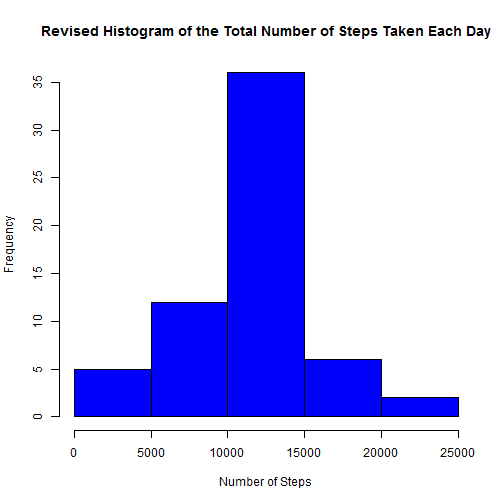

This report analyzes [data](https://d396qusza40orc.cloudfront.net/repdata%2Fdata%2Factivity.zip) from a personal activity monitoring device, which collects data about the number of steps at 5 minute intervals through out the day from an anonymous individual during the two months of October and November in 2012.  

For all the R code chunks in this report, the global setting echo = TRUE is used.  


```r
suppressWarnings(library(knitr))
suppressWarnings(library(plyr))
suppressWarnings(library(ggplot2))
suppressWarnings(library(lattice))
opts_chunk$set(echo = TRUE)
```

This report answers the following questions:

## Loading and preprocessing the data.

1. Load the data.  
2. It's not necessary to process/transform the data.  


```r
d0 <- read.csv("activity.csv")
```

## What is mean total number of steps taken per day?

1. Calculate the total number of steps taken per day, and store the result in the variable **by.day**. Missing values in the dataset are ignored *for now* with the argument sum(..., na.rm = TRUE), which essentially means that they are treated as zeros (NA = 0).  
2. Make a histogram of the total number of steps taken each day.  
3. Calculate and report the mean and median of the total number of steps taken per day.  


```r
by.day <- ddply(d0, .(date), summarise,
                total = sum(steps, na.rm = TRUE))
hist(by.day$total, breaks = 5, col = "red",
     main = "Histogram of the Total Number of Steps Taken Each Day",
     xlab = "Number of Steps")
```

 

```r
# Or use ggplot
#g <- ggplot(by.day, aes(total))
#g + geom_histogram(binwidth = 5000) +
#  labs(x = "Number of Steps", y = "Frequency")
  
# Or use lattice
#histogram(by.day$total, type = "count", breaks = 5,
#          xlab = "Number of Steps", ylab = "Frequency")
  
mean0 <- mean(by.day$total)
mean0 <- format(mean0, scientific = FALSE)
median0 <- median(by.day$total)
median0 <- format(median0, scientific = FALSE)
```

- Answer 3: The mean and median of the total number of steps taken per day are mean0 = **9354.23**, median0 = **10395**. The fact of mean0 < median0 means that this distribution is probably skewed to the left (negative skew), as can be seen also from the histogram.  

## What is the average daily activity pattern?

1. Make a time series plot of the 5-minute interval (x-axis) and the average number of steps taken, averaged across all days (y-axis).  
2. Which 5-minute interval, on average across all the days in the dataset, contains the maximum number of steps?  


```r
by.int <- ddply(d0, .(interval), summarise,
                average = mean(steps, na.rm = TRUE))
plot(by.int$interval, by.int$average, type = "l",
     main = "Times Series of the Average Number of Steps",
     xlab = "Interval", ylab = "Number of Steps")
```

 

```r
# Or use ggplot
#g <- ggplot(by.int, aes(x = interval, y = average))
#g + geom_line() + labs(x = "Interval", y = "Number of Steps")
  
# Or use lattice
#xyplot(average ~ interval, data = by.int, type = "l",
#       xlab = "Interval", ylab = "Number of Steps")
  
by.int.ordered <- by.int[order(by.int$average, decreasing = TRUE), ]
max.steps = by.int.ordered$average[1]
max.interval = by.int.ordered$interval[1]
```

- Answer 2: The interval that contains the maximum number of steps (max.steps = 206.1698113) is max.interval = **835** (Perhaps a walk to work every morning?).  

## Imputing missing values

1. Calculate and report the total number of missing values in the dataset.  
2. Adopt the strategy of *filling in the NAs with the mean for that 5-minute interval*.  
3. Create a new dataset named **d.comp** that is equal to the original dataset but with the missing data filled in.  
4. Make a histogram of the total number of steps taken each day and calculate and report the mean and median total number of steps taken per day. Do these values differ from the estimates from the first part of the assignment? What is the impact of imputing missing data on the estimates of the total daily number of steps?  


```r
na.count <- sum(!complete.cases(d0))
  
FillNA <- function(x) replace(x, is.na(x), mean(x, na.rm = TRUE))
d.comp <- ddply(d0, .(interval), transform, steps = FillNA(steps))
  
by.day.comp <- ddply(d.comp, .(date), summarise, total = sum(steps))
hist(by.day.comp$total, breaks = 5, col = "blue",
     main = "Revised Histogram of the Total Number of Steps Taken Each Day",
     xlab = "Number of Steps")
```

 

```r
mean.comp <- mean(by.day.comp$total)
mean.comp <- format(mean.comp, scientific = FALSE)
median.comp <- median(by.day.comp$total)
median.comp <- format(median.comp, scientific = FALSE)
```

- Answer 1: The total number of missing values in the dataset is na.count = **2304**.  
- Answer 4: The revised mean and median total number of steps taken per day are mean.comp = **10766.19**, median.comp = **10766.19**. They are identical to each other, but quite different from (larger than) the previous estimates of mean0 = **9354.23** and median0 = **10395**. With imputed missing data, the distribution becomes more symmetric (less skewed) and more concentrated around the mean (smaller variance/standard deviation), and the estimates (mean and median) are larger and more consistent.  

## Are there differences in activity patterns between weekdays and weekends?

1. Create a new factor variable named **wkday** in the dataset with two levels - "weekday" and "weekend" indicating whether a given date is a weekday or weekend day. The dataset with the filled-in missing values **d.comp** is used for this part.  
2. Make a panel plot containing a time series plot of the 5-minute interval (x-axis) and the average number of steps taken, averaged across all weekday days or weekend days (y-axis).  


```r
# Ensure that weekday abbreviations are in English.
invisible(Sys.setlocale("LC_ALL","English"))

d.comp$date <- as.Date(d.comp$date, "%Y-%m-%d")
d.comp$wkday <- factor(weekdays(d.comp$date, abbreviate = TRUE) %in% c("Sat", "Sun"),
                       levels = c("FALSE", "TRUE"),
                       labels = c("weekday", "weekend"))
by.wkday <- ddply(d.comp, .(interval, wkday), summarise,
                  average = mean(steps))
  
xyplot(average ~ interval | wkday, data = by.wkday,
       layout = c(1, 2), type = "l",
       xlab = "Interval", ylab = "Number of Steps")
```

 

```r
# Or use ggplot
#g <- ggplot(by.wkday, aes(x = interval, y = average))
#g + geom_line() + facet_wrap(~ wkday, nrow = 2) +
#  labs(x = "Interval", y = "Number of Steps")
```

- The plot alone answers the question well enough.  

The End.  
